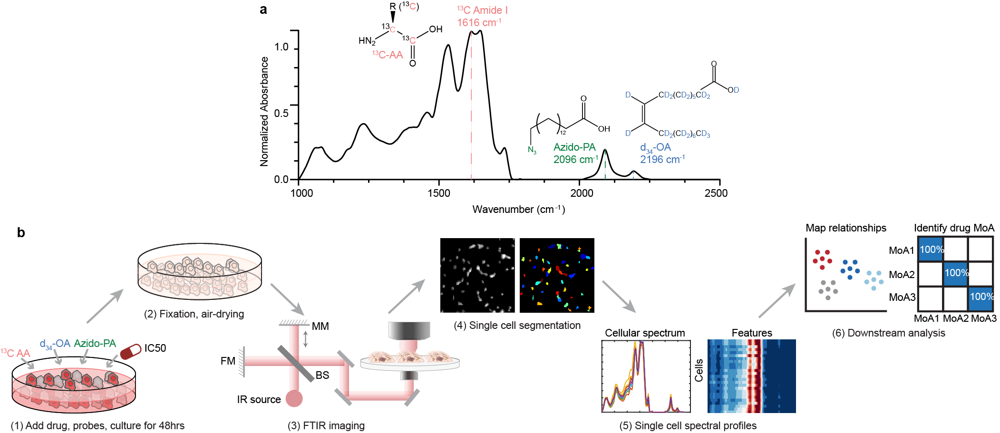

# VIBRANT

© 2023 The Trustees of Columbia University in the City of New York.  The codes and data in this work may be reproduced, distributed, and otherwise exploited for academic non-commercial purposes only.  To obtain a license to the codes and data in this work for commercial purposes, please contact Columbia Technology Ventures at techventures@columbia.edu.

This is the github repository for paper "VIBRANT: spectral profiling for single-cell drug responses", published in Nature Methods (https://www.nature.com/articles/s41592-024-02185-x, DOI: 10.1038/s41592-024-02185-x). 

## Abstract
High-content cell profiling has proven invaluable for single-cell phenotyping in response to chemical perturbations. However, methods with improved throughput, information content and affordability are still needed. We present a new high-content spectral profiling method named vibrational painting (VIBRANT), integrating mid-infrared vibrational imaging, multiplexed vibrational probes and an optimized data analysis pipeline for measuring single-cell drug responses. Three infrared-active vibrational probes were designed to measure distinct essential metabolic activities in human cancer cells. More than 20,000 single-cell drug responses were collected, corresponding to 23 drug treatments. The resulting spectral profile is highly sensitive to phenotypic changes under drug perturbation. Using this property, we built a machine learning classifier to accurately predict drug mechanism of action at single-cell level with minimal batch effects. We further designed an algorithm to discover drug candidates with new mechanisms of action and evaluate drug combinations. Overall, VIBRANT has demonstrated great potential across multiple areas of phenotypic screening.

  

## Requirements
The code was implemented in python 3.7.

## Data
Processed single-cell infrared spectrum data of all the drug treatments is avilable in VIBRANT_data, named as "SingleCellSpec_alldrug.mat". For each drug treatment, its corresponding single cell spectrum is named as "CELL_SPEC_ALL_" + "drugname". The wavenumber matrix ("wave_all.mat") is also provided in this data to indicate the wavenumber location of each vibrational peak in the infrared spectrum.

## Codes
The main codes for data preprocessing, predicting drug MoAs using machine learning and identifying test compounds with novel MoAs using novelty detection are included in VIBRANT_MainCodes.ipynb.
